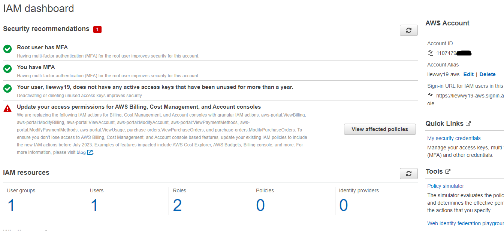

# Week 0 — Billing and Architecture

## Required Homework/Tasks

### Watched Week 0 - Live Streamed Video 
:white_check_mark:Done

### Watched Chirag's Week 0 - Spend Considerations 
:white_check_mark:Done

### Watched Ashish's Week 0 - Security Considerations 
:white_check_mark:Done

### Recreate Conceptual Diagram in Lucid Charts or on a Napkin

### Recreate Logical Architectual Diagram in Lucid Charts

### Create an Admin User	


### Use CloudShell	


### Generate AWS Credentials	


### Installed AWS CLI	


### Create a Billing Alarm	


### Create a Budget	


## Homework Challenges


***

## Getting the AWS CLI Working

We'll be using the AWS CLI often in this bootcamp,
so we'll proceed to installing this account.


### Install AWS CLI

- We are going to install the AWS CLI when our Gitpod enviroment lanuches.
- We are are going to set AWS CLI to use partial autoprompt mode to make it easier to debug CLI commands.
- The bash commands we are using are the same as the [AWS CLI Install Instructions]https://docs.aws.amazon.com/cli/latest/userguide/getting-started-install.html


Update our `.gitpod.yml` to include the following task.

```sh
tasks:
  - name: aws-cli
    env:
      AWS_CLI_AUTO_PROMPT: on-partial
    init: |
      cd /workspace
      curl "https://awscli.amazonaws.com/awscli-exe-linux-x86_64.zip" -o "awscliv2.zip"
      unzip awscliv2.zip
      sudo ./aws/install
      cd $THEIA_WORKSPACE_ROOT
```

We'll also run these commands indivually to perform the install manually

### Create a new User and Generate AWS Credentials

- Go to (IAM Users Console](https://us-east-1.console.aws.amazon.com/iamv2/home?region=us-east-1#/users) andrew create a new user
- `Enable console access` for the user
- Create a new `Admin` Group and apply `AdministratorAccess`
- Create the user and go find and click into the user
- Click on `Security Credentials` and `Create Access Key`
- Choose AWS CLI Access
- Download the CSV with the credentials

### Set Env Vars

We will set these credentials for the current bash terminal
```
export AWS_ACCESS_KEY_ID=""
export AWS_SECRET_ACCESS_KEY=""
export AWS_DEFAULT_REGION=us-east-1
```

We'll tell Gitpod to remember these credentials if we relaunch our workspaces
```
gp env AWS_ACCESS_KEY_ID=""
gp env AWS_SECRET_ACCESS_KEY=""
gp env AWS_DEFAULT_REGION=us-east-1
```

### Check that the AWS CLI is working and you are the expected user

```sh
aws sts get-caller-identity
```

You should see something like this:
```json
{
    "UserId": "AIFBZRJIQN2ONP4ET4EK4",
    "Account": "655602346534",
    "Arn": "arn:aws:iam::655602346534:user/andrewcloudcamp"
}
```

## Enable Billing 

We need to turn on Billing Alerts to recieve alerts...


- In your Root Account go to the [Billing Page](https://console.aws.amazon.com/billing/)
- Under `Billing Preferences` Choose `Receive Billing Alerts`
- Save Preferences


## Creating a Billing Alarm

### Create SNS Topic

- We need an SNS topic before we create an alarm.
- The SNS topic is what will delivery us an alert when we get overbilled
- [aws sns create-topic](https://docs.aws.amazon.com/cli/latest/reference/sns/create-topic.html)

We'll create a SNS Topic
```sh
aws sns create-topic --name billing-alarm
```
which will return a TopicARN

We'll create a subscription supply the TopicARN and our Email
```sh
aws sns subscribe \
    --topic-arn="arn:aws:sns:ap-southeast-1:110747955323:billing-alarm" \
    --protocol=email \
    --notification-endpoint="liewwy19@gmail.com"
```

Check your email and confirm the subscription

#### Create Alarm

- [aws cloudwatch put-metric-alarm](https://docs.aws.amazon.com/cli/latest/reference/cloudwatch/put-metric-alarm.html)
- [Create an Alarm via AWS CLI](https://aws.amazon.com/premiumsupport/knowledge-center/cloudwatch-estimatedcharges-alarm/)
- We need to update the configuration json script with the TopicARN we generated earlier
- We are just a json file because --metrics is is required for expressions and so its easier to us a JSON file.

```sh
aws cloudwatch put-metric-alarm --cli-input-json file://aws/json/alarm_config.json
```

## Create an AWS Budget

[aws budgets create-budget](https://docs.aws.amazon.com/cli/latest/reference/budgets/create-budget.html)

Get your AWS Account ID
```sh
aws sts get-caller-identity --query Account --output text
```

- Supply your AWS Account ID
- Update the json files
- This is another case with AWS CLI its just much easier to json files due to lots of nested json

```sh
aws budgets create-budget \
    --account-id AccountID \
    --budget file://aws/json/budget.json \
    --notifications-with-subscribers file://aws/json/budget-notifications-with-subscribers.json
```

## Git Tag

Git tags are used as reference points in your development worflow.

```sh
git tag week0
git push --tags
```

To delete a tag

#### local
```sh
git tag -d <tag_name>
```

#### remote
```sh
git push --delete origin <tag_name>
```
